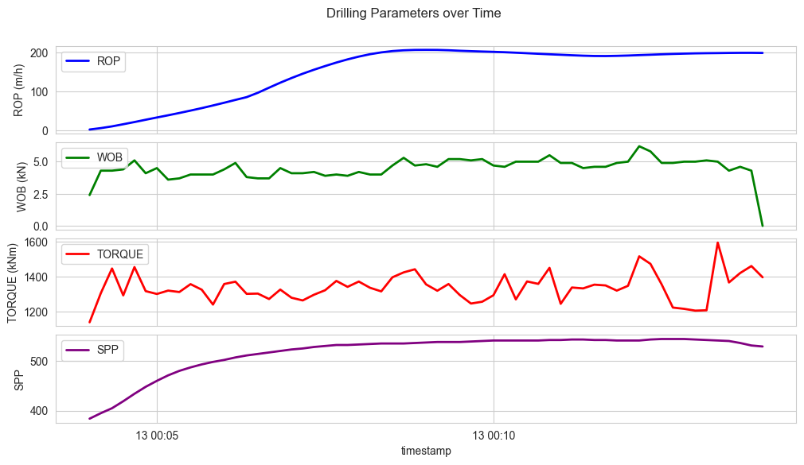

# Multi-Panel Time Series Analytics of Drilling Parameters



## Overview

This project presents a rigorous time-series analytics workflow tailored for drilling engineers, focused on extracting engineering insight from high-resolution rig sensor data. The analysis utilizes multi-panel visualization techniques to track the temporal evolution and interaction of critical drilling parameters including:

- Rate of Penetration (ROP)
- Weight on Bit (WOB)
- Rotary Torque
- Standpipe Pressure
- Rotary RPM

By synchronizing these variables over time, the notebook enables in-depth diagnostics of drilling performance, operational anomalies, and bit-rock interaction dynamics. The solution is fully interactive using `ipywidgets`, allowing real-time data playback to simulate drilling log replay — a powerful tool for wellsite surveillance and post-job forensics.

---

## Objectives

- Clean and preprocess raw rig sensor data
- Select key drilling parameters for engineering relevance
- Synchronize and align data via timestamp unification
- Create multi-panel plots to analyze temporal interdependencies
- Develop interactive playback for visual diagnostics
- Set parameter-specific axis ranges to highlight operational envelopes

---

## Data Description

The input dataset is a high-frequency CSV export from rig-based acquisition systems, likely sourced from a WITSML-compliant logger or rig historian. Each row captures a time-indexed snapshot of drilling activity. The dataset consists of:

- **Rows**: ~72,000+
- **Columns**: 119, including sensor channels, alarms, metadata
- **Time Resolution**: Sub-minute granularity
- **File Example**: `TopHole1436178691_time.csv`

### Core Parameters Used

| Column Name          | Description                                          | Units        |
|----------------------|------------------------------------------------------|--------------|
| Rate Of Penetration  | Aggregate rate of penetration                        | m/h          |
| On Bottom ROP        | ROP when bit is confirmed to be on bottom            | m/h          |
| Rotary RPM           | Rotational speed of the drill string                 | rev/min      |
| Rotary Torque        | Torque applied to rotate the string                  | kNm          |
| Weight on Bit        | Effective axial force applied to the bit             | kN           |
| Standpipe Pressure   | Hydraulic pressure at the top of the drill string    | psi (assumed)|
| Timestamp            | Merged datetime from log headers                     | datetime     |

Missing values are represented as `-999.25`, a conventional placeholder in rig data, and are rigorously filtered out prior to analysis.

---

## Methods and Features

### 1. **Data Ingestion and Timestamping**

Combines separate date and time columns into a single `timestamp` field using `pandas.to_datetime`. Ensures proper alignment of all channels for consistent time-based operations.

### 2. **Data Cleaning and Filtering**

Invalid readings such as `-999.25` and zero-RPM off-bottom noise are removed. Filtering ensures only physically meaningful drilling data is used in subsequent plots.

### 3. **Data Reshaping for Plotting**

The dataframe is transformed to a long-form (tidy) format using `pd.melt()` for compatibility with subplot and animation features.

### 4. **Static Multi-Panel Visualization**

Using `matplotlib`, multiple panels are plotted vertically sharing the same time axis. Each panel isolates one parameter to avoid visual overload while maintaining synchronized temporal scale.

### 5. **Interactive Time Series Exploration**

With `ipywidgets`, the notebook implements:

- An index slider to simulate forward scrolling
- A `Play` widget to animate the drilling process
- Real-time redrawing of all four panels as time progresses

This simulates log replays that help engineers visually correlate bit dysfunctions (e.g., torque spikes) with surface and downhole responses.

### 6. **Axis Calibration and Scaling**

To prevent scale distortion due to outliers, fixed y-axis limits are applied across all panels. This improves comparative interpretation and highlights subtle anomalies otherwise flattened by automatic scaling.

---

## Example Output


---

## Dependencies

This project is built in Jupyter Notebook and requires the following libraries:

```bash
pip install pandas matplotlib seaborn ipywidgets plotly numpy
```

Additionally, for full widget support:

```bash
pip install ipywidgets
jupyter nbextension enable --py widgetsnbextension
```

JupyterLab users may also require:

```bash
jupyter labextension install @jupyter-widgets/jupyterlab-manager
```

---

## Applications in Drilling Engineering

This framework is applicable in:

- Post-job drilling performance audits
- Real-time monitoring interfaces for wellsite engineers
- Training simulators for dynamic ROP modeling
- Precursor event detection (bit wear, motor stall, packoff)
- Data quality verification in automated rig analytics systems

---

## Author

**Destiny Otto**  
Petroleum Engineering | Data-Driven Drilling | Subsurface Analytics  
[GitHub: Otto-Destiny](https://github.com/Otto-Destiny)

---

## License

This project is released under the MIT License.

---
